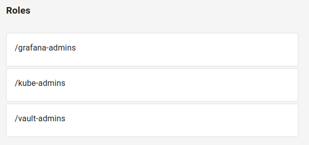
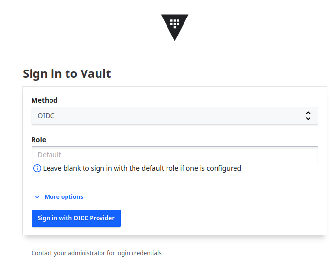
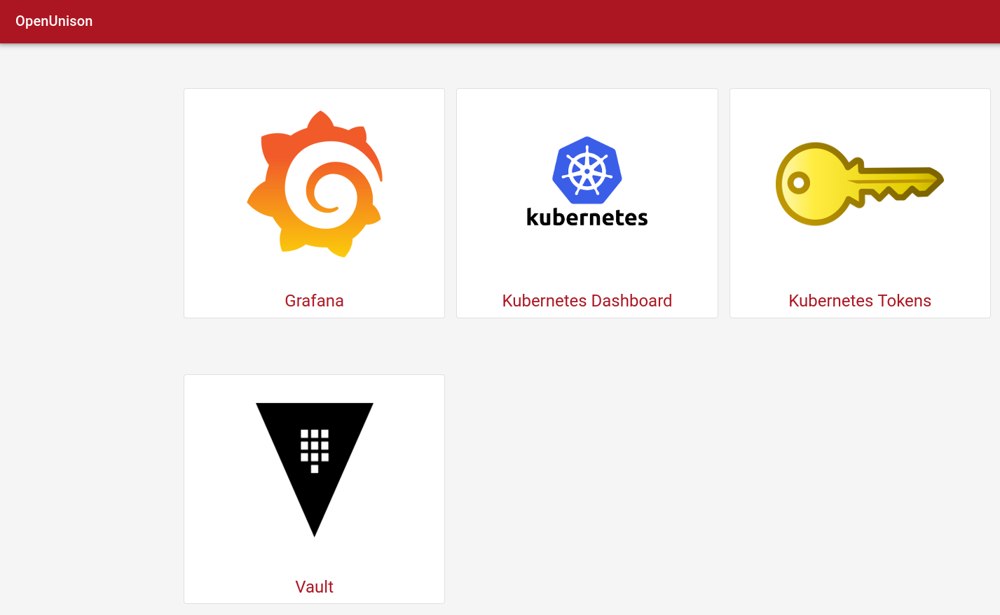

Hashicorp Vault
===

HashiCorp Vault is an identity-based secrets and encryption management system. It supports OpenID Connect for authentication. In this example Vault will be integrated with OpenUnison using `Trust`.

## Prerequisites

This example assumes the following setup:

1. Keycloak `v23.0.4` &mdash; identity provider
2. Openunison operator `v1.0.39`
3. Orchestra `v1.0.39`
4. Orchestra-login-portal `v1.0.39`
5. Hashicorp Vault `v1.15.2`

Everything is deployed inside of kubernetes cluster v1.27.3 using official Helm charts.

## Trust creation

In order to trust Vault an Openunison `Trust` custom resource has to be created. It will look like similar to this one:

```yaml
apiVersion: openunison.tremolo.io/v1
kind: Trust
metadata:
  labels:
    app.kubernetes.io/name: openunison
    app.kubernetes.io/instance: openunison-orchestra
    app.kubernetes.io/component: vault-sso
    app.kubernetes.io/part-of: openunison
  name: vault
  namespace: openunison
spec:
  accessTokenSkewMillis: 120000
  accessTokenTimeToLive: 60000
  authChainName: login-service
  clientId: vault # this is your vault client id
  clientSecret:
    keyName: vault
    secretName: orchestra-secrets-source
  codeLastMileKeyName: lastmile-oidc
  codeTokenSkewMilis: 60000
  publicEndpoint: true
  redirectURI:
  - https://vault.example.com/ui/vault/auth/oidc/oidc/callback
  - https://vault.example.com/oidc/oidc/callback
  signedUserInfo: false
  verifyRedirect: true
```

**Note:** secret `orchestra-secrets-source` must contain `vault` key with client secret.

Deploy this CR using any method suitable for you: kubectl, argo cd etc.

## Vault configuration

Vault has not only to trust Openunison but also map roles from Openunison to roles inside Vault.  That requires several configuration steps.

### Enable OIDC auth method

Vault cli will be used for Vault configuration.

Enable OIDC:

```
vault auth enable oidc
```

Set up default oidc role:

```
vault write auth/oidc/role/default \
  bound_audiences="vault" \
  allowed_redirect_uris="https://vault.example.com/ui/vault/auth/oidc/oidc/callback" \
  allowed_redirect_uris="https://vault.example.com/oidc/oidc/callback" \
  user_claim="name" \
  role_type="oidc" \
  groups_claim="groups"
```

**Note:** `bound_audiences` value must be the same as `clientId` in Trust. Values of `allowed_redirect_uris` must also match with `redirectURI` in Trust.

### Configure the OIDC auth method

Set these options for oidc config:

```
vault write auth/oidc/config \
  oidc_discovery_url="https://k8sou.example.com/auth/idp/k8sIdp" \
  oidc_client_id="vault" \
  oidc_client_secret="<vault client secret>" \
  default_role=default
```

Let's explain the options:

`oidc_discovery_url` &mdash; hostname of your Openunison instance
`oidc_client_id` &mdash; vault client id; must be the same as `clientId` in Trust
`oidc_client_secret` &mdash; vault client secret; must match with the value of the `vault` key in `orchestra-secrets-source` secret
`default_role` &mdash; default vault role; must match with the oidc role configured earlier

### Create required policies

Vault provides a fine-grained control over secrets using policies. Set up policies according to your needs. In this example only one policy will be created:

```
tee admin.hcl <<EOF
path "*" {
capabilities = ["create", "read", "update", "delete", "list", "sudo"]
}
EOF

vault policy write admin ./admin.hcl
```

This policy gives admin permissions in the entire Vault instance. Use at your own risk!

### Create required groups

Number of groups must match with the number of policies set up. In this example only one group is requred:

```
vault write identity/group \
  name=admin \
  type=external \
  policies=admin
```

**Note:** `policies` value must match with policy name created earlier.

### Create required group aliases

```
vault write identity/group-alias \
  name=/vault-admins \
  mount_accessor=<oidc auth accessor> \
  canonical_id=<admin group id>
```

Let's explain the options:

`name` &mdash; name of the alias; must match with role name inside of Openunison

`mount_accessor` &mdash; accessor value which corresponds to oidc auth method

`canonical_id` &mdash; id of the group created earlier

How to get `mount_accessor` value:

```
vault auth list

Path        Type       Accessor                 Description                Version
----        ----       --------                 -----------                -------
oidc/       oidc       auth_oidc_xxxxxxxx       n/a                        n/a
```

How to get `canonical_id` value:

```
vault read identity/group/name/admin

Key                  Value
---                  -----
id                   xxxxxx-xxxx-xxxx-xxxx-xxxxxxxxxxxx
```

When Openunison is integrated with Keycloak groups from Keycloak appear in Openunison with slashes:



These slashes must be added to the alias name:

```
name=/vault-admins
```

When Vault configuration is complete you can check if integration is working. For that go to vault login page and select OIDC method:



## Create portal badge

To add a portal badge to OpenUnison, customize the below yaml to point to your Vault and update for where you want it displayed on your portal and who can see the badge:

```yaml
apiVersion: openunison.tremolo.io/v1
kind: PortalUrl
metadata:
  labels:
    openunison.io/instance: orchestra
  name: vault
  namespace: openunison
spec:
  label: Vault
  org: B158BD40-0C1B-11E3-8FFD-0800200C9A66
  url: https://vault.example.com/
  icon: iVBORw0KGgoAAAANSUhEUgAAANIAAADwCAYAAAB1/Tp/AAABhGlDQ1BJQ0MgcHJvZmlsZQAAKJF9kT1Iw1AUhU/TiiIVBztIcQhSnSyIijhqFYpQIdQKrTqYvPQPmjQkKS6OgmvBwZ/FqoOLs64OroIg+APi7OCk6CIl3pcUWsR44fE+zrvn8N59gNCoMM0KjQOabpvpZELM5lbF7lcEEEUIMQzLzDLmJCkF3/q6p26quzjP8u/7s/rUvMWAgEg8ywzTJt4gnt60Dc77xBFWklXic+Ixky5I/Mh1xeM3zkWXBZ4ZMTPpeeIIsVjsYKWDWcnUiKeIY6qmU76Q9VjlvMVZq9RY6578heG8vrLMdVpDSGIRS5AgQkENZVRgI067ToqFNJ0nfPxR1y+RSyFXGYwcC6hCg+z6wf/g92ytwuSElxROAF0vjvMxAnTvAs2643wfO07zBAg+A1d6219tADOfpNfbWuwI6N8GLq7bmrIHXO4Ag0+GbMquFKQlFArA+xl9Uw4YuAV617y5tc5x+gBkaFapG+DgEBgtUva6z7t7Ouf2b09rfj9wiHKm5T7rWQAAAAZiS0dEAP8A/wD/oL2nkwAAAAlwSFlzAAAN1wAADdcBQiibeAAAAAd0SU1FB+gBGgQpIqIo29cAABFdSURBVHja7Z1bbF1Vesd/59ixw6RJgHESI5ICEgN0JKBoaCECpTPSpAVFbSUGNFR9GNGqnb4UjQYNKk99pAVFXB6C2gqGAAOBBBgKySQmgGPolDQEciGJcW5O7CSOEzu+xLHPdffh2w4cbJ9zHPvsvfbe/590FOnk7O2911r/df0uIIQQQgghhBBCCCGEEEIIIYQQQgghhBBCCCGEEEIIIYQQQgghhBBCCCGEEEIIIURiSdXonvOBOSpe4SA5YBjwXBdSI/AS8OPZflghZqG9vw/8DMjM5o3ra/CweeAt4L4a3V+ImbbN/GzfOF2Dhy0AnwA7VW/CMT7z22YhCkIC6ANeB4qqO+EIRWCd3zaJipDGgFagXfUnHGG/3yYzURISwCFgi0Yl4chotMVvk0RNSMPYDskJ1aMImS6/LY5EUUgA24EdGpVEiBSA//PbIlEVUj/wHjCo+hQhMQi8CwxEWUgAm4AOdDgrwlkbtQOba/2HghDSaewQLKd6FQGTB94AzsRBSADrgeOqVxEwR/xOnLgI6RiwQfUqAuZ1Ato1DkpInv9SPapbERBdfuftxU1Ih7DdEyGC4LfA0bgJCeCCP189pzoWNaYXeAcYDeoPBimkIrAH2KZ6FjXmI2AvARoCpAN+wdPYudKw6lrUiAHgd8DZIP9o0EIqAB8DX6q+RY3YBbQRsFlaOoQX7fCnd2OqczHLjAAfAJ1B/+EwhFTEdlROqt7FLNPtty0vCUICc/n9X2rgOy8SSxb4EHPgIylCKmCRhrTpIGaLYWAtIbnspEN88TZ/ZJJVuJgpnj8afRHWA4QppAzwX8gqXMSgLYUppPFeZJfagZgh28Ke3aRDLoBQ57UiFuSBl8Neb4ctpCy276+wXeJS2YEDO8BpBwriBCHt/YvIU8CMU0M/k3RBSOeBrZjznxDToR0L+jgmIRm7sZjMWiuJ6YxGbThit+mKkPqxSC99ah+iSnowT4IRCamUDzDzDo1KoprRaBfmSYCENLGHeQ9ZhYvKXMAiUw1KSJPzJha2Szt4Yio84Ct/WoeENDlHse1MCUlMRRF4hQCCPkZZSAC/wVzShZiMw35ni4RUng4UtkuU72idSxXkYrLkHPAa8FNgYRRr+tFHH+XBBx+kWJx6AzKXy7FhwwZWr1598bubb76Zxx9/nObm5rL37+np4bHHHmPv3r0Xv3vkkUe4//77mTNnztS9ZjrNunXreOKJJ6Iqoi6/k81LSNXNgfdh2+H3RbG2r732Wm677bayv8nn8+zYsaPku4ULF3LrrbeydOnSstd2d3ezcGFpH3PNNddw++23U19fvko//fTTKI9G/43F83ZuDZ12tMDOAW/jyGHbdPG8yvVcLBYn/M7zvLKj2GxcW82zOcppLMyWk17Vrgopj2VY+0xLAuHze2Anjh7Ypx0uuKOYMasOaMU5oAWHd3NdFlLeL7wjakeJ56DfFjwJ6dL4HHPaUlyH5HIB2OJ6h+q6kMZTF/arPSWWs1huLSSkmdHqj0yyCk8eecy9pl1CmjlZ4Ndo0yGp07oXMLcJp6mPSIFuwTwh/zQS3Wg+T6FQoFCYuv6z2eyE//c8j1wuRy6Xm/K8J5VKTfr/hUKBbDZb9rnq6urI5yMVJXoLlucICWl2e6YfAHWuP+yBAwdoaWmpaCK0f39pmOq+vj7a2tpYvHhx2fv39vbS11fqTLx//362bt1a0UTowIEDURFRxq/zSMxEUhHqna7BfFC+7/qDXnHFFSxatKisFYHneZw9e5aBgYGSEWPZsmU0NDSUHZGy2SxdXV0lI9rll19OU1MTqdTUVZpKpThz5gznzkUi++gW4GfIE2DW+Q7wr9hZgj7x/mSBvwPmRKVxpiMkpPHzhE71KbFnJxE7P0xHrIA7gPfVzmJNJC1a6iNWyP1+If8VsMTVh2xubuaqq64q+5tiscjp06fp6en5ujLq67nhhhtobGwsvwrPZOjo6CjZgWtubmbJkiWk0+X7xlOnTpX8TQc57HeWGQmptvwPlgfnL1zdLFm1ahWrVq0qu9mQy+XYvHkzL7744sXvrrvuOh5++GEWLVpU9v5nzpxh9erVHDx48OJ39957L/fcc09Zf6RUKsXGjRt5/vnnXR6NPsUO4EUA/AIYcnWxvGbNGq8S2WzWe+aZZ0quu/vuu72urq6K1x47dsy76667Sq599tlnvWw2W/HaNWvWuLzJ0OPPNiJHOqJCegdzs3DSGrga5znP8yb9XbXXVnu/S7l/SBSBPcBHElJwHMW8JZXMOT5ksDBbwxJSsLwM9Kr9xYYDOBb0MSlC+irKBS8m8CIRdpeJspAKWNrMQbXByDPeKRYlpBDW9JhFuA5oo8/rOJB1L6lCAsv29xowqrYYWY5hzntjElK407vPsVBNIpq0YB6wnoQULieAjUTMpEQA5iLRAgxE/UXqY1AZOWAbtn36xy48UGtrK+l0uqxjXz6f5+OPSxPOdXV1sXbtWq688sqy9+/r66Orq6vku7a2NqvQMiZC6XSa1tZWl+ruC8zkK/JpfFLEgznAauCfcMCHZd68eRNic38bz/MYGhpiZGSkpKE3NTVVjN+dy+U4e/ZsiZXCvHnzWLBgQVnHPoDBwcGSvxkig5h/2TMamN1iJV9n+9PH/c8e4Lq4NL50jITU5m88FNSnOE/GX9d2xuWF6mNWOa8CPwIWhDpfTqUqTs/Gs0d8ex1VX19fcXpWLBYnRCBKpVLU1dVVvLZQKFSVtaLGnMNMvDwJyU02AfuBO8Jc/91yyy3cdNNNFRt0R0cHe/bsufjdggULWLFiBfPmzSt77fnz52lra2N4+Gv7zqamJlasWFFRwMeOHWPXrl2MjYV2bONheY4OamB2e/PkH7HgGaHN/59++mkvk8l4o6OjU34GBwe9J598suS65cuXex0dHWWvGx0d9drb273ly5eXXLty5Uqvv7+/7HWZTMZ79dVXvRtvvDHMtdEwcGeMNrpiOSKN93a/AP4orIeYM2cODQ0N5Ren6fSEGHR1dXXMnTuXuXPnlr22sbFxgkt5Op2u6tqGhoaK7ug1ZqM/a4hV5vo08WMA82sR7jHm181I3F4sjkIa3xE6rnbrHNuA3cRwZzWOQvIwQ8h31G6dIutPu3vi+HLpmFbaABZMUuFu3WE38AkxTRqXjnHFySrcrdFoGxHIcyQhTeQU5vQnD9rw6Qbe8wUlIUWQLZgbs6e2HBp5YAcW+BEJKZocIYTwt5XMdMZ/M9nvqrl2snOgVCpV1flQNfefZYYxL+ZY+4vVE39eA/4WuDawOeWpUxw8eLCsTVs2m50Qg3tkZIRDhw5VdHM4ceLEhN8MDw/T3t5e9kA2lUrR3d0dpHmQ528yfBj3RpYEIe33R6W/D2oEbmlp4eTJ8rE8CoUC+/btK/mus7OT5557jvnz55e9dmhoiM7OzpLvDh8+zFNPPVXR1u7IkSOcPh3YZmYey/87jIgFd2Ix0+QHFOzncxzOGqI10vTZA2xVfxI4a4lw0EcJaSIZv1IVtis4vsICm+QlpPgwHrbrE7XvwHgb6CIhRw/1CarYs8AG4M+ABhcfsLm5mQceeKBi4JSBgQHWr18f5KbBdDmGbfCMJKVxJUlIOSzB727gT1x8wGXLlvHQQw9x9dVXT5nHKJVKcfz4cbZv3+6ykD4GdpGgg/AkCQksmfMHwG0uvntjYyNNTU0sXry47O9GR0crOg6GSC9mUdKfpIaVTpiQMv4CuDPKL+Fw1j0ww9TE7ZAmTUj407vPULa/WjAMvEtMfY4kpFLGgDeRVXgt6AHeSOKLpxNa4ZuJQQYEx8gBb2Fb3hJSQjgPvIQyWMwmg9ihtychJYu3sOzoQuUpIc2wB31J07tZG+HXJnmET7KQxuf03VF78BCc8yqxiYR7IteTbE4B64FfuvAw2WyW/v5+LrvssrK/6+vrI5t1JvzBKGZ6NZDkhpRKuJBSwA+BdcDi0Hu1+nquv/76ilYLmUyGw4cPk887cRS2Ffg55tYvEswSLB2MHPGm/xkFfqWZTbLXSOOcxmzDBlQU0+YrzHYxLyEJMGvl3SqG6S3psETKe1QUEtI4R/ye9YKKomrO+JsMslmUkEqI5FZ4SBSwoI8KCS0hTWAfFn9NPWxlxrAwWzKxEpNyhz9l0Y5c+c82Qk54rRHJbb4APlIxlKUIPI+ZBQkxKSngz7GgHRp5Jv/sBJaqqWhEKsd4Q1HYrql51Z/+CgmpLEPAb7TpMCnt/oZMVkUhIVUiB2z3RyZRyibgIHI9kZCq5BiWGb2oorjIcezQWpsMElLVjAGtWBw8YSPQDiwCk5CQpsVOv+EUVBT0+9O6cyoKCWm6XMASCPdqNOKwXxZCQrok3gcOJHytNIbZIfaqOUhIl8ow8DrJtgrvxfLwCglpRryJ7eIlkSLmhn9CzUBCminngJdJ5qZDkt9dQlKvrNFYQnJ3nbBO60MhIc2M8QwWSTLW3ALsR9YdEtIs4mFxHTYm5H1H0BmahFQj+rDT/SSE7foMs+rQaCQh1WRU2oFZhsd9GtsKHFKVS0i1ohML0Xs+5u/4nkYjCanWbCa+ca5zWIitL1TNElKt+RKLohNHL9EB4BV0ACsC4k4sJUycgpoUsYzkjapeERT1WPbuAvHKLPGXqloRNCv9TYc4BX28QtWqNVLQbCc+sa894AXMLEhISIEy4je+OCzMP8dS2ygEmYQUOAXs9H9HDN5lg795IiSkUDjtN8Iox3lrxywZRlWdElJYjPlTov0RXhu1YilthIQUKvuwDBZRHJVOYu4S2mSQkEJnBGghetn+PGCvPyIJCckJtmHJnKNk6DkIvI2yuUtIDjEE/Nb/NyqjUZcvJCEhOcXbmAtCFNZKOSzP0VlVm3CRR7EExa6bA3UBf6jqEq6yFAtf5bqQ/g1oUHVpaucqUQjv24eFFsupuoSrpIBbfEG5Ohr9J3C5qkojkst4WGa7dxx9viH/2YZUVRKS6wxhaVAGHXy2D4neeZeElFCKWFyHNsee6zxmgaHMEhJSZOjGbNhGHHqmL4muTaCElOC10ke4Y1U9hpkxtatqJKSoccCf3o058CwnMb8pISLJHXxtNhTWJwesVacpokwdZtOWD1FI54AfqipE1FmJbYWHJaR3gbmqBhF1voPt4IUhogzw15jFhRCRJgXc769VghZSK7BYVSDiQjMWuitIERWAf0BW3oGgnZxg6MeyPATJF8AnxDNrhoSUULJY2K69Af09D0vT2amil5DixmG/cQfBIcxAVUEfJaTYMeI37lqPEkXgUyyhspCQYsl2/1NLw9Fe7OzovIpbQoorg8DvMHfvWo1GHZi7hBCx5rtYXqUis7/lfR74uYpYJIVf+Wum2RZSO7BIxSuSwlLg6CyLKA/8i6brIknUYbHlZjOZcxdwnYpWJI3vA2dmUUj/DlymYhVJYx7wH7Mkol7MiVBW3iJxpIEfYeG7ZiqkF4AmFWm4lSnCoYjtsr0/w/sMYKZHfSpSCSmpjFshXJjBPcYzqyvMloSUWAqYXdzOS7z+PPABlgFDSEiJpgOLgTfdsF0eZuW9SUUoIQlbK228hFEli7mSH1ARCmHUAb/2xVHtTl038AMVnRCl/BjL6VptPIZXfAEKIb7BXMzFohqr8CEU9FGIKfmJv+lQTdDHP1BxCTE536Vy2K4scJ+mdUJMTT0Wi65S0MelKiohyvM9YA9T+xz9Mwr66Bw6R3KPE0ydy2gvCvooIYmquOBP34586/sCFs5LWfeEqJLLsQPab07rjmApYoQQ0+BvgJ5vrI3WYylihBDTYLE/lStiFg8/VZEIcWn8Egsq+XtgvopDiEtjKbAbBX10Hp2Ou82wP7V7g+n7KwkhvkEjig4khBBCCCGEEEIIIYQQQgghhBBCCCGEEEIIIYQQQgghhBBCCCGEEEIIIYQQQgghhHCX/wcPkhtoi3lSrQAAAABJRU5ErkJggg==
  azRules:
  - constraint: o=Tremolo
    scope: dn
```

The end result should look like this:



## Troubleshooting

When set up for the first time Vault may throw an error that OIDC provider didn't send back required data. Orchestra container in its turn complains that `Trust 'vault' not found` in logs. If you experience just the same try restarting orchestra pod. Restart of the orchestra pod also helps when portal badge does not appear on the portal page.